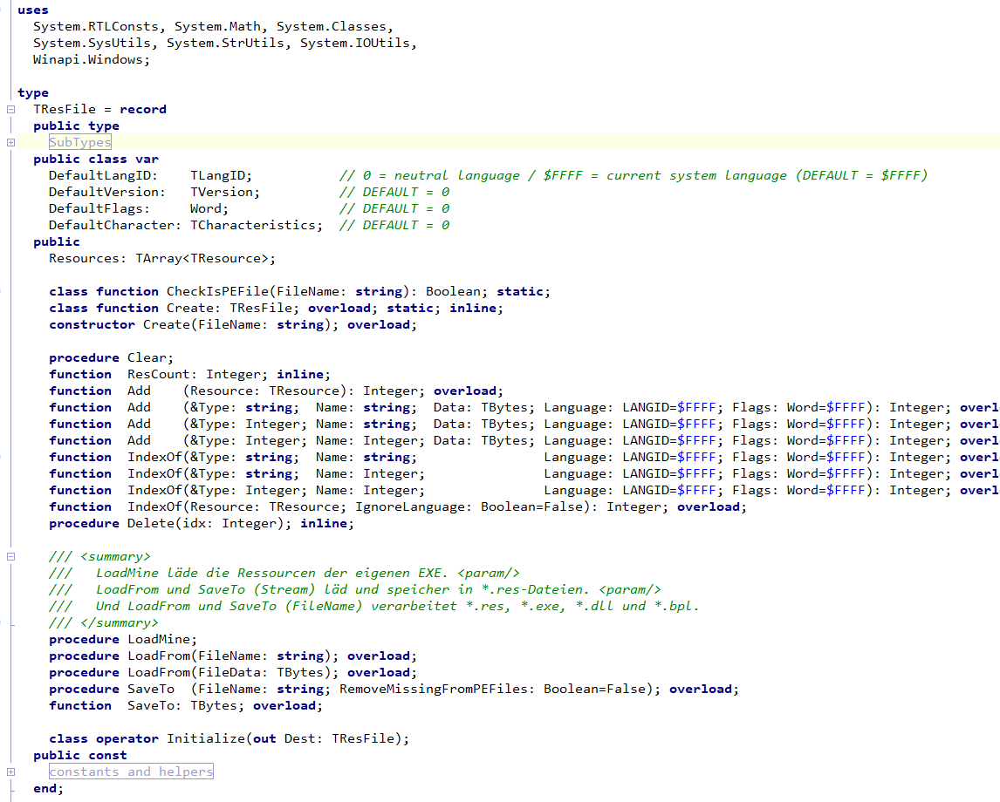
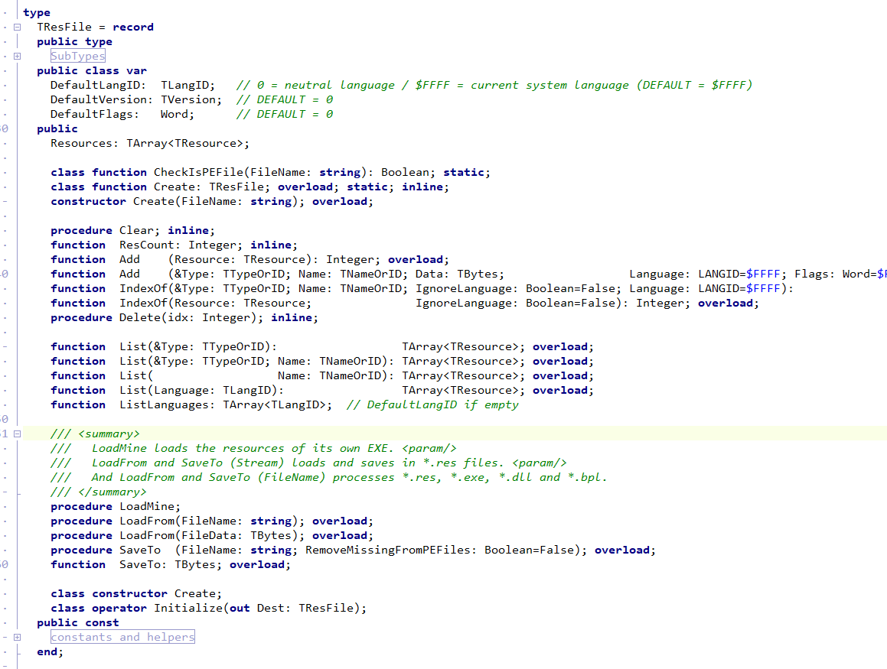

# h5u.ResFile.pas
* read and write .RES files, also with resources from PE files (EXE/DLL/BPL)

'''pascal
var ResFile := TResFile.Create('file.res');
for var Res in ResFile.Resources do
  if Res.Type_ = 'RT_RCDATA' then
    Memo1.Lines.Add(Res.Type_.Name + ' ' + Res.Name);

for var Res in ResFile.Find(RT_RCDATA) do
  Memo1.Lines.Add(Res.Name.Name);
'''

Version 1.0

Version 2.0

